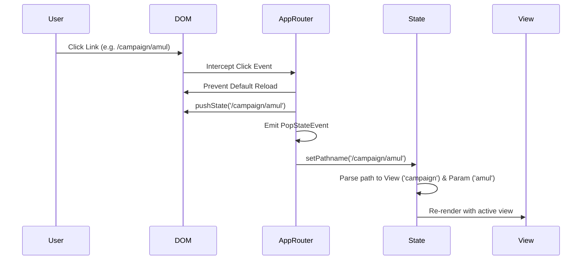

# AdVault — Technical Project Report & Architectural Documentation

Welcome to the comprehensive technical documentation for **AdVault** (Offline Marketing Intelligence). This report provides a detailed breakdown of each module, the data mapping flows, routing mechanisms, and the database schema model.

---

## 1. System Architecture Overview

AdVault is structured as a **monorepo** consisting of two main sub-projects:
1. **`Advault-web`**: A high-performance, single-page React frontend application built using **TypeScript**, **Vite**, and **Vanilla CSS** tokens.
2. **`Advault-cms`**: A headless content management system built on **Sanity Studio v3**, exposing a **GROQ API** for structured query retrieval.

### Architecture Topology
```mermaid
graph TD
    subgraph Client App (Advault-web)
        UI[React UI Components]
        Router[Custom History Router]
        Ctx[AdVaultDataContext]
        SC[Sanity Client API]
    end

    subgraph Content Platform (Advault-cms)
        SS[Sanity Studio UI]
        DB[(Sanity Data Store)]
    end

    UI --> Router
    UI --> Ctx
    Ctx --> SC
    SC -- GROQ Query --> DB
    SS -- Read/Write --> DB
```

---

## 2. Directory & Modules Directory Structure

```text
AdVault/
├── README.md
├── Advault-cms/                  # Sanity Studio CMS
│   ├── schemaTypes/              # Document & Object schema types
│   │   ├── documents/            # Primary Sanity Documents
│   │   │   ├── campaign.ts
│   │   │   ├── brand.ts
│   │   │   ├── source.ts
│   │   │   └── ...
│   │   └── objects/              # Nested CMS structures
│   ├── sanity.config.ts          # Studio Configuration
│   └── sanity.cli.ts             # CLI Configuration
│
└── Advault-web/                  # React Frontend Application
    ├── index.html
    ├── vercel.json               # SPA Redirect Configuration
    ├── src/
    │   ├── main.tsx
    │   ├── App.tsx               # View Switching & Event Listeners
    │   ├── types.ts              # Global TypeScript interfaces
    │   ├── sanityClient.ts       # Sanity CDN client initialization
    │   ├── context/
    │   │   └── AdVaultDataContext.tsx  # Dynamic Data Fetching & Mapping
    │   └── components/
    │       ├── layout/           # Shared Navigation and Footer
    │       ├── home/             # Marketing & Spotlight sections
    │       ├── discover/         # Searchable library & filters
    │       ├── brand/            # Brand timeline and profiles
    │       ├── campaign/         # Campaign detail view and references
    │       └── compare/          # Matrix comparison grids
```

---

## 3. Module Breakdown & Flows

### A. Frontend Web Application (`Advault-web`)

#### 1. Data Layer (`AdVaultDataContext.tsx`)
The application uses a unified React Context (`AdVaultDataContext`) to manage the global state of the application. It acts as the data-fetching and mapping engine.
* **Flow**:
  1. On initial mount, it runs `loadCMSData()` to query the Sanity API.
  2. Queries campaigns, brands, and referenced sources using a **single optimized GROQ query**.
  3. Maps Sanity's rich Portable Text format and nested objects into clean TypeScript interfaces.
  4. If the CMS query fails (due to network or API constraints), it automatically catches the error and falls back to loading static datasets (`data.ts`) to guarantee offline-first availability.

#### 2. Navigation & History Router (`App.tsx`)
Rather than relying on third-party routing libraries or hash fragments (e.g. `/#discover`), the project implements a clean, native **Browser Pathname Router**.
* **Path Interception**:
  A global event listener intercepts all anchor `<a>` clicks starting with a forward slash `/`. It suppresses page reloads (`e.preventDefault()`) and transitions routes via `history.pushState()`.
* **State Syncing**:
  Listens to the browser's `popstate` event to update the active view state (`currentView`, `parameter`) dynamically when user navigates using back/forward buttons.



#### 3. View Architecture
The frontend is divided into specialized, decoupled view folders:

| View Module | Description | Core Elements / Data Bound |
| :--- | :--- | :--- |
| **`HomeView`** | Spotlight landing page. | Featured campaigns carousel, search bar, documented brands grid. |
| **`DiscoverView`** | Library search interface. | Search text, Industry filters, Channel filters, campaigns grid. |
| **`BrandsView`** | Documented brand directory catalog. | Alphabetic listing card layout of all brands. |
| **`BrandDetailView`** | Single brand dossier. | Brand header metadata, dynamic historical timeline of campaigns. |
| **`CampaignDetailView`**| Vetted campaign report. | Dynamic Table of Contents, Editorial sections, references, media. |
| **`CompareView`** | Matrix evaluation tool. | Side-by-side comparison matrix of campaign metrics and strategies. |

---

### B. Content Management System (`Advault-cms`)

The CMS translates marketing parameters into structured fields. Below are the key documents defined under `schemaTypes/documents/`:

#### 1. Campaign Schema (`campaign.ts`)
Stores the main case studies. Key fields include:
* `title` & `slug` (Identifiers)
* `brand` (Reference to `brand` document)
* `campaignSummary`, `campaignBackground`, `campaignPurpose` (Portable Text blocks)
* `targetAudience`, `demographics`, `consumerInsights` (Audience segment blocks)
* `marketingStrategy`, `positioning`, `keyMessaging` (Strategic vectors)
* `mediaMix` (Array of custom nested `mediaMix` objects)
* `resultMetrics` (KPI metrics with numeric parameters)
* `keyLearnings` (Takeaways for marketing playbook)
* `documents` (PDF/file attachments of the actual research paper or case study report)

#### 2. Brand Schema (`brand.ts`)
Stores brand profiles:
* `name` & `slug`
* `logo` (Sanity Image with transparency support)
* `industry` (Reference to `industry` taxonomy)
* `description` (Rich text summary)
* `founded` (Year of establishment)

#### 3. Source Schema (`source.ts`)
Manages literature citations and academic references:
* `title` & `sourceName`
* `sourceType` (Dropdown: book, news article, research paper, case study, web archive)
* `url` (Web link)
* `file` (Direct PDF document upload of the research paper)
* `author`, `publisher`, `publishedDate`, `accessedDate`
* `notes` (Portable Text capturing direct quotes and excerpts)

---

## 4. Key Custom Integrations

### Dynamic Table of Contents (TOC) & Sequential Section Numbering
* **The Problem**: If a researcher skips sections in the CMS (e.g. entering data for Section 1, 3, and 5 but leaving 2 and 4 blank), displaying empty headers or rendering missing sections breaks user readability.
* **The Solution**:
  1. `CampaignDetailView` evaluates the campaign data at runtime to find which sections contain actual data.
  2. It generates a sequential numbering map (e.g., if only sections 1, 3, and 5 exist, they are mapped to visual numbers `01`, `02`, and `03`).
  3. The Table of Contents is generated dynamically from this active map. Clicking an item scrolls the page smoothly to the correct section anchor.

### Structured Bibliography Citing & PDF Integration
* **Citation Formats**:
  The references component parses references dynamically into an APA/Harvard styled block:
  `Author (Year). "Title". Source Name, Publisher [Source Type].`
* **Direct Access**:
  - If a website URL exists: Renders `[Access Link]`.
  - If a raw PDF/document is uploaded: Renders a bold `[View Full Document]` link that opens the document directly from Sanity's CDN.
* **Excerpts Accordion**:
  If key quotes are added, they are nested in an expandable `<details>` block: **"View Case Study Notes & Excerpts"**.

### Compare Matrix Layout & Safe Cell Fallbacks
* **Robust Row Fallbacks**:
  To prevent empty cells when fields are empty in the CMS, cells utilize layered backups:
  - **Objective**: Displays `goals` $\rightarrow$ falls back to `problem` statement $\rightarrow$ falls back to `overview` text.
  - **Key Learning**: Displays specific `learnings[0]` $\rightarrow$ falls back to playbook `recommendations` $\rightarrow$ defaults to `"N/A"`.

---

## 5. Production Deployment Guide

### A. Frontend Redirects (Vercel & Netlify)
Since browser-history routing sends path requests directly to the server on reload, static hosting must reroute all paths back to `/index.html`.
* **Vercel**: Handled via `vercel.json`:
  ```json
  {
    "rewrites": [
      {
        "source": "/(.*)",
        "destination": "/index.html"
      }
    ]
  }
  ```
* **Netlify**: Handled via `public/_redirects`:
  ```text
  /*    /index.html   200
  ```

### B. Sanity API CORS Origin Setup
To authorize Vercel to read data from the Sanity dataset, run this command in your `Advault-cms` directory:
```bash
npx sanity cors add https://*.vercel.app --credentials --yes
```
If using a custom domain for your production site:
```bash
npx sanity cors add https://yourdomain.com --credentials --yes
```
This adds the origin to the project settings, allowing your frontend to connect successfully.
